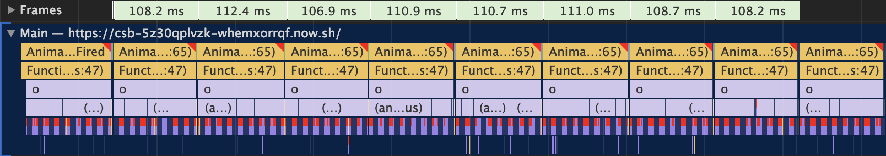
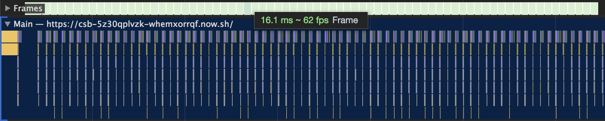

# budu.js


> A **bu**nch of **D**OM **u**pdates.
>
> Don't let the browser throw away the hard work it has done for you.

Library to batch DOM reads and writes to reduce layout thrashing and getting a better performance for animations, visualisations or layout reflows.

[Why should I care?](https://developers.google.com/web/fundamentals/performance/rendering/avoid-large-complex-layouts-and-layout-thrashing)

> When you change styles the browser checks to see if any of the changes require layout to be calculated, and for that render tree to be updated. Changes to “geometric properties”, such as widths, heights, left, or top all require layout.

In data visualisation or for animation, a developer might want to update a lot of elements. This is possible with the following code:

```js
// let's assume elements is an array of 100 divs we want to animate
elements.forEach(el => {
  // read from the DOM
  const bounds = el.getBoundingClientRect()
  // write to the DOM
  el.style.left = bounds.x + 10
})
```

*This is inefficient as it forces synchronous layout updates.* Every time the `left` style of an element gets updated, the browser has to recalculate the layout before the next call to `getBoundingClientRect`, triggering the following flow:

::: danger A lot of work
read > update > **layout** > read > update > **layout** > read > update > **layout** > read > ...
:::

That leads to a performance bottleneck. To mitigate the problem, it is better to first read all values and after that modify the DOM. Therefore, the browser doesn't have to recalculate layout that much and we get a flow similar to this:

::: tip Less work
read > read > read > update > update > update > **layout**
:::

We reduced layout calls to 1 and with the above code example we would have reduced 100 calls to 1. The code would look like this:

```js
let elementSizes = []
elements.forEach(el => {
  // read from the DOM
  const bounds = el.getBoundingClientRect()
  elementSizes.push(bounds)
})

elements.forEach((el, i) => {
  // write to the DOM
  el.style.left = elementSizes[i].x + 10
})
```

This was a lot to read, now let's see an example! Press the `▶️ Start` button to start the animation. It will run with the default browser behaviour and a lot of synchronous layout calls.

While the animation runs, click on `🐇 Scheduled` to see the animation run super smooth. Now all reads happen before all writes.

<iframe src="https://csb-5z30qplvzk-mejhkzrelv.now.sh/" style="width:100%; height:450px; border:0; border-radius: 4px; overflow:hidden;" sandbox="allow-modals allow-forms allow-popups allow-scripts allow-same-origin"></iframe>

::: tip Play around with the example on CodeSandbox
[https://codesandbox.io/s/5z30qplvzk](https://codesandbox.io/s/5z30qplvzk)
:::

::: warning Be careful
Before rewriting all your code, please actually measure if layout is the problem. The default browser behaviour is usually fine.
:::

You might say "This looks simple, it's 2 loops" and that is correct. In a large app or visualisation, you might update styles in a lot of places. Rewriting all these calls, to execute in batches, is a hassle. This is where `budu` comes into play. Call `budu`s `schedule` function and it will coordinate all layout reads and writes in your app for you. The above code example in `budu` looks like this:

```js
import schedule from 'budu'

elements.forEach(el => {
  schedule({
    measure: () => el.getBoundingClientRect()
    // the return value of `measure()` is available in `update()`
    update: bounds => { el.style.left = bounds.x + 10 }
  })
})
```

### Performance Analysis

The screenshots visualise the work the browser has to do, to animate the example above. Screenshots taken with Chrome Devtools. 

#### Default browser behaviour (forced synchronous layout)

To render 1 frame the browser needs ~100ms which means it can render at **10** frames per second.

#### `budu` batched DOM reads and writes

To render 1 frame the browser needs less than 16ms which means it can render at more than **60** frames per second.

## Usage

To use `budu` install it with `npm` or `yarn` as follows.

```bash
> npm install --save budu
# or
> yarn install budu
```

After that you can `import` or `require` it from your source files.

```js
import schedule from 'budu'
/* or */
const schedule = require('budu')
```

::: warning
`budu` uses `window.requestAnimationFrame` to schedule measurement and updates. Some older browsers don't support this API. You can still use `budu` by using a polyfill for `requestAnimationFrame` like [`raf/polyfill`](https://www.npmjs.com/package/raf).

To see if the browser you want to support implements `requestAnimationFrame`, follow this link -> [Can I Use](https://caniuse.com/#feat=requestanimationframe).
:::

## API

```js
import schedule from 'budu'

schedule({
  measure: () => {
    // call all your expensive DOM reads here
    const bounds = element.getBoundingClientRect()
    return bounds
  },
  update: (bounds) => {
    // write to the DOM in here
    element.style.left = bounds.x + 20 + 'px'
  }
})
```

---

I made this mini library to simplify creating performant data visualisations. I learned a lot and took inspiration from the following articles and libraries:

* [Browser Rendering Optimizations for Frontend Development](https://scotch.io/tutorials/browser-rendering-optimizations-for-frontend-development)
* [Avoid Large, Complex Layouts and Layout Thrashing](https://developers.google.com/web/fundamentals/performance/rendering/avoid-large-complex-layouts-and-layout-thrashing)
* [FastDOM](https://github.com/wilsonpage/fastdom)
